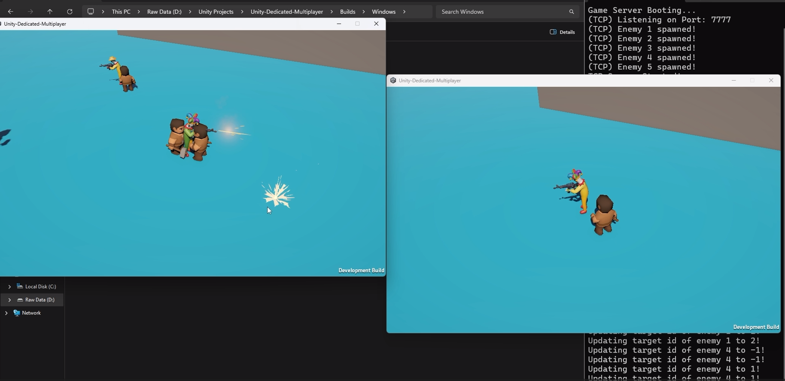

# Multiplayer Top-Down Shooter (Unity + Custom .NET Server)

A fully custom-built multiplayer prototype created with **Unity (Client)** and a **self-written .NET dedicated server**.  
This project demonstrates how to build real-time multiplayer **without Mirror, Photon, Netcode, or any 3rd-party networking libraries**.

This repo is designed as an educational resource for developers who want to understand how multiplayer games function at a low level — from raw TCP/UDP packets to authoritative game simulation.

---

## Features

### **Custom .NET Game Server**
- Fully standalone server built in C# (.NET)
- Authoritative game logic
- TCP for commands & reliability  
- UDP for fast state updates  
- Multi-threaded architecture

### **Unity Client**
- Smooth top-down player controller  
- Player movement synced via UDP  
- Player rotation synced (mouse-based aiming)  
- Shooting replicated using server-validated hitscan  
- Networked interpolation system for jitter-free visuals  

### **Server-Controlled AI Enemies**
- AI logic fully executed on server  
- Wander → Chase → Attack behavior  
- Same deterministic movement on all clients  

### **Scalable Architecture**
- Clean modular server design  
- Easy to add new packet types & game systems  
- Foundation suitable for match-based games  
- Can be extended into an MMO-style architecture later

## Tech Stack

### **Server**
- C# (.NET 8)
- TCP sockets
- UDP sockets
- Multi-threaded listeners
- Deterministic game loop (60 ticks/s)

### **Client**
- Unity 2022+
- Rigidbody movement
- Custom interpolation system
- Top-down aiming (mouse raycasting)
- Lightweight network transform

### **How To Install**
- Clone the project
- Open project in unity and build to any platform (Win or Mac recommended but can work on other devices as well)
- Run the server from terminal by going to GameServer folder and running "dotnet run" command
- Run the build and clients should connect

---

## A Demo Video

  

